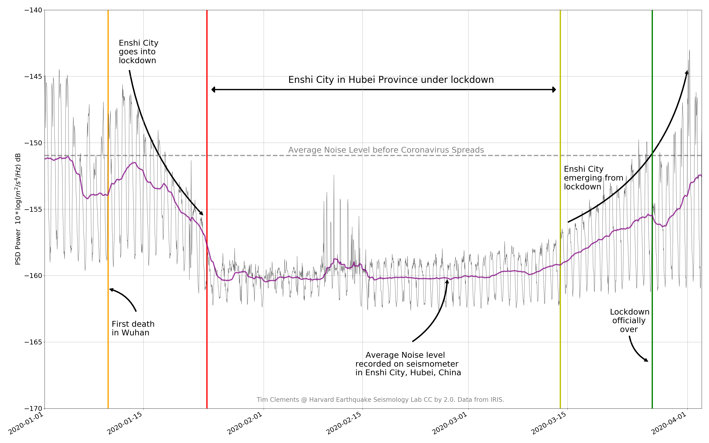

# Covid19-Response in China

China has been both praised and condemned for its response to Coronavirus/COVID19. The government first instituted a complete lockdown of Hubei Province, where the virus first spread in the city of Wuhan, on January 23rd [[1]](https://www.nytimes.com/2020/01/23/world/asia/china-coronavirus-outbreak.html). All roads in Hubei Province were blocked, trains did not run and flights were grounded, preventing the spread of the virus to other cities in China. All told the lockdown extended to 760 million people across the country [[2]](https://www.nytimes.com/2020/02/15/business/china-coronavirus-lockdown.html). In Hubei province the lockdown lasted for two months. It is estimated that without controls, 500 million people in China would have been infected with Coronavirus, while only 81,000 tested positive [[3]](https://www.nature.com/articles/d41586-020-00741-x). 

## Monitoring the Lockdown with Seismic Noise

The main source of seismic noise at frequencies above 1 Hz is human activity, usually in the form of cars, planes, trains and machinery [[4]](https://www.nature.com/articles/s41598-017-15499-y). I was interested in finding out if the lockdown in China could be seen on seismometers in Hubei Province. The only publicly available seismic station I could find in Hubei province is located in [Enshi City](https://ds.iris.edu/gmap/#network=IC&station=ENH&starttime=2019-12-01&planet=earth), a county-level city about 500km to the west of Wuhan. 

To track the effects of the lockdown in Wuhan, I computed the seismic power P, 

where `u` is seismic velocity of a vertical component seismogram, each hour from January 1st, 2020 to April 4th, 2020 using the seismic station in Enshi City. I calculated seismic power in the 1-10 Hz band (the sampling rate of the seismometer is only 20 Hz, unfortunately). The classical formula for power was dominated by large amplitude events, such as earthquakes, so I used a modified version of the power using the median of the squared amplitudes for each hour, i.e. 

Here is the result: 

The thin black line is the hourly power measurements, while the thicker purple line is a two-day moving average.  The figure shows spectacularly well the stages of the lockdown in Hubei province, specifically:

- reduction in seismic power following the first death in Wuhan on January 10th
- further drop in power after the lockdown in Enshi City on January 24th
- consistently low power until the blockade was lifted on March 14th
- increasing seismic power (and activity) until the lockdown was ended on March 27th
- seismic power in Enshi City on April 4th is almost back to the same level as it was pre-pandemic

I have data for more stations in the `IC` network in China, which I will add when I get a chance. It will be interesting to compare the response in Hubei to that of other provinces. 

## Code to Reproduce
I made this figure using `obspy`, `numpy`, `pandas` and `matplotlib`. I assigned this as a homework problem to the class I am TFing this semester (EPS55: Earthquakes and Tectonics). I will post code to reproduce the plot once all problem sets are turned in. 

